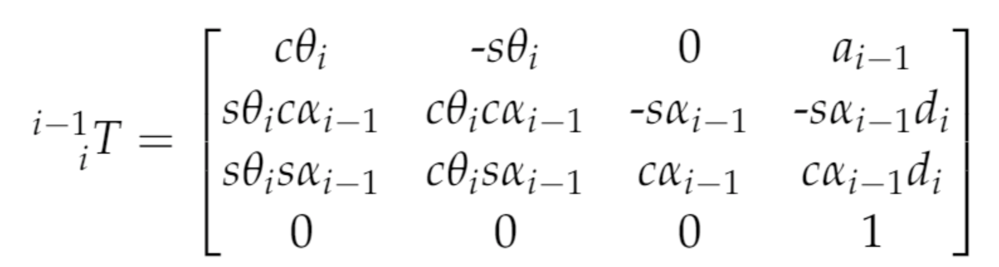

## Project: Kinematics Pick & Place

### Project Implementation

#### Installation
The code was implemented using Python2.7, ROS Kinetic (for installation please use the following [link](http://wiki.ros.org/kinetic/Installation/Ubuntu), 
and Gazeebo 7.12.0.
The installation of ROS Kinetic could be difficult (if not impossible) on some operating systems. Therefore, to insure compatibility, the project
was implemented in a docker image (based on Ubuntu 16.04). Please find accompanying images [here](https://hub.docker.com/r/aponamarev/ubuntu_ros_vnc/).
*Initial Setup*
1. To install project please first pull the aforementioned docker image:
```
docker pull aponamarev/ubuntu_ros_vnc
```
2. Install vnc viewer - [real vnc](https://www.realvnc.com/en/).
3. Launch the docker
```
docker run -it -p 5900:5900 aponamarev/ubuntu_ros_vnc
```
4. Once the docker is running, connect to the docker using vnc viewer.

Once the *initial setup* is done, please install ROS following provided [instructions](http://wiki.ros.org/kinetic/Installation/Ubuntu), and git clone this project.

#### FK and IK code
The code related to Forward and Inverse Kinematics is located in the following files:

* IK_debug - debugging code implemented using sympy and designed to verify the accuracy of both inverse and forward kinematic calculations. 
* IK_server - implementation of ROS server in python2.7 deigned to evaluate theta angles for a given planning path  

#### Running code
Following the setup of the project execute the following command to launch pick and place project:
```
~/catkin_ws/src/RoboND-Kinematics-Project/kuka_arm/scripts/safe_spawner.sh
```  


[//]: # (Image References)

[image1]: ./misc_images/misc1.png
[image2]: ./misc_images/misc3.png
[joints]: ./misc_images/joints.png
[t2_3]: ./misc_images/thetas2_3.png
[q1]: ./misc_images/q1.png
[q2_q3]: ./misc_images/q2_q3.png
[URDF_to_Gazebo]: ./misc_images/URDF_to_Gazebo_rf.png

### Kinematic Analysis

#### Evaluate the kr210.urdf.xacro file to perform kinematic analysis of Kuka KR210 robot.

In order to construct the table of DH parameters, it is important first to understand the position of all robot joints. 
KR210 joint coordinates were provided in the [kr210.urdf.xacro](kuka_arm/urdf/kr210.urdf.xacro).

kr210.urdf.xacro file contains x,y, z position for each joint in the following format (in ```<!-- joints -->``` section of the file)
```
<joint name="fixed_base_joint" type="fixed">
    <parent link="base_footprint"/>
    <child link="base_link"/>
    <origin xyz="0 0 0" rpy="0 0 0"/>
  </joint>
  <joint name="joint_1" type="revolute">
    <origin xyz="0 0 0.33" rpy="0 0 0"/>
    <parent link="base_link"/>
    <child link="link_1"/>
    <axis xyz="0 0 1"/>
    <limit lower="${-185*deg}" upper="${185*deg}" effort="300" velocity="${123*deg}"/>
  </joint>
```
In the example above, joint_1 considered as a child of the fixed_base_joint, and it is offset for 0.33 with respect to parent (fixed_base_joint) reference frame. Parsing the rest of the kr210.urdf.xacro file results in the following coordinates of kr210:

**Table 1 - Joint Coordinates**

|joint|x|y|z|
|--- | --- | --- | ---|
|fixed_base|0|0|0|
|joint_1|0|0|0.33|
|joint_2|0 .35|0|0.42|
|joint_3|0|0|1.25|
|joint_4|0.96|0|-0.054|
|joint_5|0.54|0|0|
|joint_6|0.193|0|0|
|gripper|0.11|0|0|

**Char 1 - Joint Coordinates**
![alt text][joints]
 
 Joint coordinates provide a solid foundation for kinematic analysis, however, they are not sufficient enough to 
 construct DH parameters. DH parameters define homogeneous transform for joints connected with a fixed link. 
 The benefit of DH transform is that it allows to define coordinates in a new reference frame using only 4 parameters:
 * alpha - twist angle - rotation around the x-axis
 * a - link length - translation along the x-axis
 * d - link offset - translation along the z-axis
 * theta - joint angle - rotation around the z-axis
 
 In order to convert joint coordinates to DH transform parameters it is important to align reference frames based on
 the joint angles. For example, joint 2 is set by default to have yaw angle of 90 degrees, switching x and z axis in 
 the reference frame for the joint 3. Therefore, the offset of joint 3 along x axis for results in the offset "a2" parameter.
 
 After accounting for all these transformations we arrive to the following table of DH parameters:
 
 **Table 2 - DH Parameters**

Links | alpha(i-1) | a(i-1) | d(i-1) | theta(i)
--- | --- | --- | --- | ---
0->1 | 0.0 | 0.00 | 0.33 | q1
1->2 | -pi / 2.0 | 0.35 | 0.42 | -pi / 2.0 + q2
2->3 | 0.0 | 1.25 | 0.00 | q3
3->4 | -pi / 2.0 | 0.0536 | 1.5014 | q4
4->5 | -pi / 2.0 | 0.00 | 0.00 | q5
5->6 | -pi / 2.0 | 0.00 | 0.00 | q6
6->EE | 0.0 | 0.00 | 0.303 | 0.0

#### Denavit-Hartenberg (DH) Parameters Derivation
Generalize DH homogeneous transform matrix is based on [Udacity Forward Kinematics Class](https://classroom.udacity.com/nanodegrees/nd209/parts/c199593e-1e9a-4830-8e29-2c86f70f489e/modules/undefined/lessons/87c52cd9-09ba-4414-bc30-24ae18277d24/concepts/c0837700-3de6-4c41-8a5d-1e25936e0cdb)


Generalized DH homogeneous transform matrix in Python code presented below:
```python
def tf_matrix(alpha, a, d, q):
  # Creates a transformation matrix based yaw, pitch, roll rotations
  # for around x, y, z rotations
  tf = Matrix([
    [cos(q), -sin(q), 0, a],
    [sin(q) * cos(alpha), cos(q) * cos(alpha), -sin(alpha), -sin(alpha) * d],
    [sin(q) * sin(alpha), cos(q) * sin(alpha), cos(alpha), cos(alpha) * d],
    [0, 0, 0, 1]
  ])
  return tf
```
The application of generalized DH homogeneous transform matrix results in the following transformation matrices:
- t0_1
```
Matrix([
[1, 0, 0,     0],
[0, 1, 0,     0],
[0, 0, 1, 0.303],
[0, 0, 0,     1]])
```
- t1_2
```
Matrix([
[sin(q2),  cos(q2), 0, 0.35],
[      0,        0, 1,    0],
[cos(q2), -sin(q2), 0,    0],
[      0,        0, 0,    1]])
```
- t2_3
```
Matrix([
[cos(q3), -sin(q3), 0, 1.25],
[sin(q3),  cos(q3), 0,    0],
[      0,        0, 1,    0],
[      0,        0, 0,    1]])
```
- t3_4
```
Matrix([
[ cos(q4), -sin(q4), 0, -0.054],
[       0,        0, 1,    1.5],
[-sin(q4), -cos(q4), 0,      0],
[       0,        0, 0,      1]])
```
- t4_5
```
Matrix([
[cos(q5), -sin(q5),  0, 0],
[      0,        0, -1, 0],
[sin(q5),  cos(q5),  0, 0],
[      0,        0,  0, 1]])
```
- t5_6
```
Matrix([
[ cos(q6), -sin(q6), 0, 0],
[       0,        0, 1, 0],
[-sin(q6), -cos(q6), 0, 0],
[       0,        0, 0, 1]])
```
- t6_ee
```
Matrix([
[1, 0, 0,     0],
[0, 1, 0,     0],
[0, 0, 1, 0.303],
[0, 0, 0,     1]])
```
- combined t0_ee
```
Matrix([
[((sin(q1)*sin(q4) + sin(q2 + q3)*cos(q1)*cos(q4))*cos(q5) + sin(q5)*cos(q1)*cos(q2 + q3))*cos(q6) - (-sin(q1)*cos(q4) + sin(q4)*sin(q2 + q3)*cos(q1))*sin(q6), 
-((sin(q1)*sin(q4) + sin(q2 + q3)*cos(q1)*cos(q4))*cos(q5) + sin(q5)*cos(q1)*cos(q2 + q3))*sin(q6) - (-sin(q1)*cos(q4) + sin(q4)*sin(q2 + q3)*cos(q1))*cos(q6), 
-(sin(q1)*sin(q4) + sin(q2 + q3)*cos(q1)*cos(q4))*sin(q5) + cos(q1)*cos(q5)*cos(q2 + q3), 
-0.303*sin(q1)*sin(q4)*sin(q5) + 1.25*sin(q2)*cos(q1) - 0.303*sin(q5)*sin(q2 + q3)*cos(q1)*cos(q4) - 0.054*sin(q2 + q3)*cos(q1) + 0.303*cos(q1)*cos(q5)*cos(q2 + q3) + 1.5*cos(q1)*cos(q2 + q3) + 0.35*cos(q1)],
[((sin(q1)*sin(q2 + q3)*cos(q4) - sin(q4)*cos(q1))*cos(q5) + sin(q1)*sin(q5)*cos(q2 + q3))*cos(q6) - (sin(q1)*sin(q4)*sin(q2 + q3) + cos(q1)*cos(q4))*sin(q6),
-((sin(q1)*sin(q2 + q3)*cos(q4) - sin(q4)*cos(q1))*cos(q5) + sin(q1)*sin(q5)*cos(q2 + q3))*sin(q6) - (sin(q1)*sin(q4)*sin(q2 + q3) + cos(q1)*cos(q4))*cos(q6), 
-(sin(q1)*sin(q2 + q3)*cos(q4) - sin(q4)*cos(q1))*sin(q5) + sin(q1)*cos(q5)*cos(q2 + q3),  
1.25*sin(q1)*sin(q2) - 0.303*sin(q1)*sin(q5)*sin(q2 + q3)*cos(q4) - 0.054*sin(q1)*sin(q2 + q3) + 0.303*sin(q1)*cos(q5)*cos(q2 + q3) + 1.5*sin(q1)*cos(q2 + q3) + 0.35*sin(q1) + 0.303*sin(q4)*sin(q5)*cos(q1)],
[(-sin(q5)*sin(q2 + q3) + cos(q4)*cos(q5)*cos(q2 + q3))*cos(q6) - sin(q4)*sin(q6)*cos(q2 + q3),
-(-sin(q5)*sin(q2 + q3) + cos(q4)*cos(q5)*cos(q2 + q3))*sin(q6) - sin(q4)*cos(q6)*cos(q2 + q3),
-(sin(q5)*cos(q4)*cos(q2 + q3) + sin(q2 + q3)*cos(q5)),
-0.303*sin(q5)*cos(q4)*cos(q2 + q3) - 0.303*sin(q2 + q3)*cos(q5) - 1.5*sin(q2 + q3) + 1.25*cos(q2) - 0.054*cos(q2 + q3) + 0.75],
[ 0, 0, 0, 1]])
```
#### Inverse Kinematics problem
Pick and place project provides us with the planning path (locations) for the end effector (gripper). In order to follow 
provided coordinates of the end effector we have to convert coordinates into appropriate theta angles of robot joints. In
order to evaluate theta angles we can trigonometric relationships embedded into DH homogeneous transformation.

**Theta 1** 
 
 KR210 is fixed at the position of the base (xyz=0,0,0). The axis of the first joint reference frame are aligned with the
 base axis, where x points in the direction of the arm movement, y is perpendicular ot x, and z points upwards. Therefore,
 joint 1 is responsible for setting rotation of the main body of the arm along z axis, which allows to evaluate theta1 angle,
 based on the x and y position of the wrist center (WC): theta1 = atan(wc.y, wc.x).
 
 **Figure - Theta 1**
 ![alt text][q1]
 
 **The extra operation needed to adjust the discrepancy between the DH table and the URDF reference frame**
 
 In order to evaluate the position of WC we fist have to account for the difference between URDF files and Gazebo.
 The picture below shows the difference between two refernce frames:
 
 ![alt text][URDF_to_Gazebo]
 
 In order to adjust reference frames we need to rotate coordinates first along z axis by 180 degrees (pi) and then along y axis by 90 degrees (pi/2).
 
 Therefore, the correct coordinates of wrist center calculated as follows:
 
 ```python
 WC = EE - 0.303 * rot_ee[:, 2]
 ```
 where rot_ee[:, 2] was adjusted for the difference between Gazebo and URDF reference frames (rot_error):
 ```python
rot_z_adj = rot_z(np.radians(180))
rot_y_adj = rot_y(np.radians(-90))

rot_error = np.matmul(rot_z_adj, rot_y_adj)

rot_ee = np.matmul(rot_ee, rot_error)
 ```
 
 
 theta1 = np.arctan2(WC[1,0], WC[0,0])
 
 **Thetas 2 and 3**
 
 In order to calculate angles 2 and 3 we can use the law of cosines. The law of cosines states that the sides of a triangle
 defined by the following relationship: c^2 = a^2 + b^2 - 2 * a * b * cos(lambda), where lambda is the angle between sides a and b.
 Knowing the measurement of tingle sides (kuka kr 210 links between joints 2, 3, and wrist center (WC)), 
 it is possible to calculate the angles of the triangle.
 
 ![alt text][t2_3]
  
 The calculations below first assign known link measurements to the triangle sides, then calculates unknown side, and a last step
 if finds the angle measurements using acos function:
  
```python
s_a = 1.5014
s_c = 1.25
s_b = sqrt(pow(sqrt(WC[0] * WC[0] + WC[1] * WC[1]) - 0.35, 2) + pow(WC[2] - 0.75, 2))

# Angle a (between sides b and c of the triangle
aa = acos( (s_b * s_b + s_c * s_c - s_a * s_a) / (2 * s_b * s_c) )
# Angle b (between sides a and c of the triangle
ab = acos((s_a * s_a + s_c * s_c - s_b * s_b) / (2 * s_a * s_c))
```
 Then derived angles should be converted into theta 2, 3 based on their joint orientations:

```python 
 theta2 = pi / 2 - aa - atan2(WC[2] - 0.75, sqrt(WC[0] * WC[0] + WC[1] * WC[1]) - 0.35)
 theta3 = pi / 2 - (ab + 0.036)
 ```
Where atan2(WC[2] - 0.75, sqrt(WC[0] * WC[0] + WC[1] * WC[1]) - 0.35) is theta 2 adjustment based on the location of the WC.
**Figure - Theta 2 and 3**
![alt text][q2_q3]

**Thetas 4 through 6 - Inverse Orientation**

Theta angles 1 through 3 determine the location of the end effector. Remaining three joints (4,5, and 6) responsible for the orientation
of the end effector. These angles calculated based on the math presented in 
[Udacity class on inverse kinematics recap](https://classroom.udacity.com/nanodegrees/nd209/parts/c199593e-1e9a-4830-8e29-2c86f70f489e/modules/8855de3f-2897-46c3-a805-628b5ecf045b/lessons/91d017b1-4493-4522-ad52-04a74a01094c/concepts/a1abb738-84ee-48b1-82d7-ace881b5aec0)).

First, since the combined result of all joint angles produces the and orientation of end effector, the rotation matrix of the end effector
should be equal to the product of joint 0 through 6 rotations:
```python
r0_6 = t01[0:3, 0:3] * t12[0:3, 0:3] * t23[0:3, 0:3] * t34[0:3, 0:3] * t45[0:3, 0:3] * t56[0:3, 0:3] * t6_ee[0:3, 0:3]
```
and
```python
r0_6 == rot_ee
```
therefore
```python
rot_ee == t01[0:3, 0:3] * t12[0:3, 0:3] * t23[0:3, 0:3] * t34[0:3, 0:3] * t45[0:3, 0:3] * t56[0:3, 0:3] * t6_ee[0:3, 0:3]
```

The next step is based on our thetas 0-3 calculated above. Since our thetas 1 - 3 allow us to calculate homogeneous
transforms (t) and rotation matrices (r), r=t[0:3, 0:3], we can evaluate the value remaining rotation matrices 4 - 6:
```python
rot_ee == (r01 * r12 * r23 * r34 * r45 * r56 * r6_ee)
r4_6 = (t34[0:3, 0:3] * t45[0:3, 0:3] * t56[0:3, 0:3])
rot_ee == r0_3 * r4_6 
r4_6 == rot_ee / r0_3 == r0_3.inv() * rot_ee  
```
Considering that rotation matrices are orthogonal, it is possible to simplify the calculation of the inverse matrix. 
The inverse matrix of an orthogonal matrix equals to the transpose of itself:
```python
r0_3.inv() == r0_3.T
# Therefore
r3_6 = r0_3.T * rot_ee
```
The last step in inverse orientation is the extraction of theta values. Considering that rotation matrix r3_6 has the following
format, we can evaluate thetas 4 through 6 as follows:
```
r3_6 = t34[:3, :3] * t45[:3, :3] * t56[:3, :3]
print r3_6
Matrix([
[-sin(q4)*sin(q6) + cos(q4)*cos(q5)*cos(q6), -sin(q4)*cos(q6) - sin(q6)*cos(q4)*cos(q5), -sin(q5)*cos(q4)], 
[sin(q5)*cos(q6),                            -sin(q5)*sin(q6),                                    cos(q5)], 
[-sin(q4)*cos(q5)*cos(q6) - sin(q6)*cos(q4), sin(q4)*sin(q6)*cos(q5) - cos(q4)*cos(q6), sin(q4)*sin(q5)]
])
```

**Theta 4**

Theta 4 can be evaluated based on atan2 of the q4. Given that r3_6[2, 2], -r3_6[0, 2] contain sin and cos of q4, it is 
possible to calculate tanh of the angle (tanh = sin / cos). sin(q5) present in both r3_6[2, 2], -r3_6[0, 2] will present
in both multiplier and denominator of tanh, and therefore doesn't affect the tanh value unless sin(q5)==0 degrees (0 or pi).

**Effect of theta 5 of theta 4 calculation**

In case theta 5 equals 0 or 180 degrees (pi), sin(q5), multiplier in the top and bottom sides of theta4 IK equation, is equal 0,
which will lead to both top and bottom side of the theta 4 equation equal to 0.
```
theta4 = atan2(sin(q4)*sin(q5), sin(q5)*cos(q4)) = atan2(r3_6[2, 2], -r3_6[0, 2])
```
**Theta 5**

Theta 5 angle has 2 solutions:
1) Given that r3_6[0, 2] = -sin(q5)*cos(q4) and r3_6[2, 2] = sin(q4)*sin(q5), 
sin(p5) = sqrt(r3_6[0, 2] ** 2 + r3_6[2, 2] ** 2) = sqrt( sin(q5)^2*cos(q4)^2 + sin(q4)^2*sin(q5)^2 ) = sqrt( sin(q5)^2*(cos(q4)^2 + sin(q4)^2) ) = sqrt( sin(q5)**2 ), 
given cos(q4)^2 + sin(q4)^2 == 1. Therefore:
```
theta5 = atan2(sqrt((r3_6[0, 2] ** 2 + r3_6[2, 2] ** 2)/2), r3_6[1, 2])
 = atan2(sqrt(sin(q5)^2*cos(q4)^2 + sin(q4)^2*sin(q5)^2), cos(q5))
```
2) Alternatively, sin(q5) can also be calculated using r3_6[1, 0] = sin(q5)*cos(q6) and r3_6[1, 1] = -sin(q5)*sin(q6).
Here the solution is similar to the option 1:
sin(q5) = sqrt(r3_6[1, 0] ^ 2 + r3_6[1, 1] ^ 2) = sqrt(sin(q5)^2*cos(q6)^2 + (-sin(q5))^2*sin(q6)^2) 
= sqrt(sin(q5)^2*(cos(q6)^2 + sin(q6)^2)) = sqrt(sin(q5)^2)
```
theta5 = atan2(sqrt(r3_6[1, 0] ** 2 + r3_6[1, 1] ** 2), r3_6[1, 2])
 = atan2(sqrt(sin(q5)^2*cos(q6)^2 + sin(q5)^2*sin(q6)^2), cos(q5)) 
```
Both solutions depend on the value of other thetas (4 and 6). Therefore, neither solution 
have any benefit. By default, I chose the fist solution, and implement the second solution in case the first solution results in error:
```python
if (round(np.cos(theta4), 4)==0.0) or (round(np.sin(theta4), 4)==0.0):
    theta5 = np.atan2(np.sqrt(r3_6[0, 2] ** 2 + r3_6[2, 2] ** 2), r3_6[1, 2])
else:
    theta5 = np.atan2(np.sqrt(r3_6[1, 0] ** 2 + r3_6[1, 1] ** 2), r3_6[1, 2])
```

**Theta 6**

The angle of theta 6 can be directly evaluate given r3_6[1, 0] = sin(q5)*cos(q6) and r3_6[1, 1] = -sin(q5)*sin(q6):
tanh(q6) = -r3_6[1, 1] / r3_6[1, 0] = sin(q5)*sin(q6) / sin(q5)*cos(q6) = sin(q6) / cos(q6) 
```
theta6 = atan2(-r3_6[1, 1], r3_6[1, 0])
```


