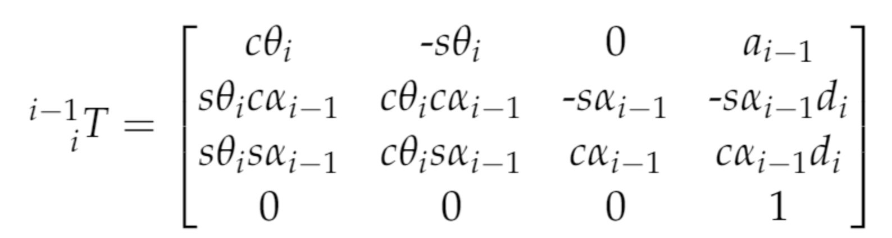

## Project: Kinematics Pick & Place
### Writeup Template: You can use this file as a template for your writeup if you want to submit it as a markdown file, but feel free to use some other method and submit a pdf if you prefer.

---


**Steps to complete the project:**  


1. Set up your ROS Workspace.
2. Download or clone the [project repository](https://github.com/udacity/RoboND-Kinematics-Project) into the ***src*** directory of your ROS Workspace.  
3. Experiment with the forward_kinematics environment and get familiar with the robot.
4. Launch in [demo mode](https://classroom.udacity.com/nanodegrees/nd209/parts/7b2fd2d7-e181-401e-977a-6158c77bf816/modules/8855de3f-2897-46c3-a805-628b5ecf045b/lessons/91d017b1-4493-4522-ad52-04a74a01094c/concepts/ae64bb91-e8c4-44c9-adbe-798e8f688193).
5. Perform Kinematic Analysis for the robot following the [project rubric](https://review.udacity.com/#!/rubrics/972/view).
6. Fill in the `IK_server.py` with your Inverse Kinematics code. 


[//]: # (Image References)

[image1]: ./misc_images/misc1.png
[image2]: ./misc_images/misc3.png
[image3]: ./misc_images/misc2.png
[joints]: ./misc_images/joints.png

### Kinematic Analysis

#### Evaluate the kr210.urdf.xacro file to perform kinematic analysis of Kuka KR210 robot.

In order to construct the table of DH parameters, it is important first to understand the position of all robot joints. KR210 joint coordinates were provided in the [kr210.urdf.xacro](kuka_arm/urdf/kr210.urdf.xacro).

kr210.urdf.xacro file contains x,y, z position for each joint in the following format (in ```<!-- joints -->``` section of the file)
```
<joint name="fixed_base_joint" type="fixed">
    <parent link="base_footprint"/>
    <child link="base_link"/>
    <origin xyz="0 0 0" rpy="0 0 0"/>
  </joint>
  <joint name="joint_1" type="revolute">
    <origin xyz="0 0 0.33" rpy="0 0 0"/>
    <parent link="base_link"/>
    <child link="link_1"/>
    <axis xyz="0 0 1"/>
    <limit lower="${-185*deg}" upper="${185*deg}" effort="300" velocity="${123*deg}"/>
  </joint>
```
In the example above, joint_1 considered as a child of the fixed_base_joint, and it is offset for 0.33 with respect to parent (fixed_base_joint) reference frame. Parsing the rest of the kr210.urdf.xacro file results in the following coordinates of kr210:

**Table 1 - Joint Coordinates**

|joint|x|y|z|
|--- | --- | --- | ---|
|fixed_base|0|0|0|
|joint_1|0|0|0.33|
|joint_2|0 .35|0|0.42|
|joint_3|0|0|1.25|
|joint_4|0.96|0|-0.054|
|joint_5|0.54|0|0|
|joint_6|0.193|0|0|
|gripper|0.11|0|0|

**Char 1 - Joint Coordinates**
![alt text][joints]
 
 Joint coordinates provide a solid foundation for kinematic analysis, however, they are not sufficient enough to construct DH parameters.
 DH parameters define homogeneous transform for joints connected with a fixed link. The benefit of DH transform is that it allows to define coordinates in a new reference frame using only 4 parameters:
 * alpha - twist angle - rotation around the x-axis
 * a - link length - translation along the x-axis
 * d - link offset - translation along the z-axis
 * theta - joint angle - rotation around the z-axis
 
 In order to convert joint coordinates to DH transform parameters it is important to align reference frames based on the joint angles.
 For example, joint 2 is set by default to have yaw angle of 90 degrees, switching x and z axis in the reference frame for the joint 3. 
 Therefore, the offset of joint 3 along x axis for results in the offset "a2" parameter.
 
 After accounting for all these transformations we arrive to the following table of DH parameters:
 
 **Table 2 - DH Parameters**

Links | alpha(i-1) | a(i-1) | d(i-1) | theta(i)
--- | --- | --- | --- | ---
0->1 | 0.0 | 0.00 | 0.33 | q1
1->2 | -pi / 2.0 | 0.35 | 0.42 | -pi / 2.0 + q2
2->3 | 0.0 | 1.25 | 0.00 | q3
3->4 | -pi / 2.0 | 0.0536 | 1.5014 | q4
4->5 | -pi / 2.0 | 0.00 | 0.00 | q5
5->6 | -pi / 2.0 | 0.00 | 0.00 | q6
6->EE | 0.0 | 0.00 | 0.303 | 0.0

#### Denavit-Hartenberg (DH) Parameters Derivation
Generalize DH homogeneous transform matrix is based on [Udacity Forward Kinematics Class](https://classroom.udacity.com/nanodegrees/nd209/parts/c199593e-1e9a-4830-8e29-2c86f70f489e/modules/undefined/lessons/87c52cd9-09ba-4414-bc30-24ae18277d24/concepts/c0837700-3de6-4c41-8a5d-1e25936e0cdb)


Generalized DH homogeneous transform matrix in Python code presented below:
```python
def tf_matrix(alpha, a, d, q):
  # Creates a transformation matrix based yaw, pitch, roll rotations
  # for around x, y, z rotations
  tf = Matrix([
    [cos(q), -sin(q), 0, a],
    [sin(q) * cos(alpha), cos(q) * cos(alpha), -sin(alpha), -sin(alpha) * d],
    [sin(q) * sin(alpha), cos(q) * sin(alpha), cos(alpha), cos(alpha) * d],
    [0, 0, 0, 1]
  ])
  return tf
```
The application of generalized DH homogeneous transform matrix results in the following transformation matrices:
- t0_1
```
Matrix([
[1, 0, 0,     0],
[0, 1, 0,     0],
[0, 0, 1, 0.303],
[0, 0, 0,     1]])
```
- t1_2
```
Matrix([
[sin(q2),  cos(q2), 0, 0.35],
[      0,        0, 1,    0],
[cos(q2), -sin(q2), 0,    0],
[      0,        0, 0,    1]])
```
- t2_3
```
Matrix([
[cos(q3), -sin(q3), 0, 1.25],
[sin(q3),  cos(q3), 0,    0],
[      0,        0, 1,    0],
[      0,        0, 0,    1]])
```
- t3_4
```
Matrix([
[ cos(q4), -sin(q4), 0, -0.054],
[       0,        0, 1,    1.5],
[-sin(q4), -cos(q4), 0,      0],
[       0,        0, 0,      1]])
```
- t4_5
```
Matrix([
[cos(q5), -sin(q5),  0, 0],
[      0,        0, -1, 0],
[sin(q5),  cos(q5),  0, 0],
[      0,        0,  0, 1]])
```
- t5_6
```
Matrix([
[ cos(q6), -sin(q6), 0, 0],
[       0,        0, 1, 0],
[-sin(q6), -cos(q6), 0, 0],
[       0,        0, 0, 1]])
```
- t6_ee
```
Matrix([
[1, 0, 0,     0],
[0, 1, 0,     0],
[0, 0, 1, 0.303],
[0, 0, 0,     1]])
```
- combined t0_ee
```
Matrix([
[((sin(q1)*sin(q4) + sin(q2 + q3)*cos(q1)*cos(q4))*cos(q5) + sin(q5)*cos(q1)*cos(q2 + q3))*cos(q6) - (-sin(q1)*cos(q4) + sin(q4)*sin(q2 + q3)*cos(q1))*sin(q6), 
-((sin(q1)*sin(q4) + sin(q2 + q3)*cos(q1)*cos(q4))*cos(q5) + sin(q5)*cos(q1)*cos(q2 + q3))*sin(q6) - (-sin(q1)*cos(q4) + sin(q4)*sin(q2 + q3)*cos(q1))*cos(q6), 
-(sin(q1)*sin(q4) + sin(q2 + q3)*cos(q1)*cos(q4))*sin(q5) + cos(q1)*cos(q5)*cos(q2 + q3), 
-0.303*sin(q1)*sin(q4)*sin(q5) + 1.25*sin(q2)*cos(q1) - 0.303*sin(q5)*sin(q2 + q3)*cos(q1)*cos(q4) - 0.054*sin(q2 + q3)*cos(q1) + 0.303*cos(q1)*cos(q5)*cos(q2 + q3) + 1.5*cos(q1)*cos(q2 + q3) + 0.35*cos(q1)],
[((sin(q1)*sin(q2 + q3)*cos(q4) - sin(q4)*cos(q1))*cos(q5) + sin(q1)*sin(q5)*cos(q2 + q3))*cos(q6) - (sin(q1)*sin(q4)*sin(q2 + q3) + cos(q1)*cos(q4))*sin(q6),
-((sin(q1)*sin(q2 + q3)*cos(q4) - sin(q4)*cos(q1))*cos(q5) + sin(q1)*sin(q5)*cos(q2 + q3))*sin(q6) - (sin(q1)*sin(q4)*sin(q2 + q3) + cos(q1)*cos(q4))*cos(q6), 
-(sin(q1)*sin(q2 + q3)*cos(q4) - sin(q4)*cos(q1))*sin(q5) + sin(q1)*cos(q5)*cos(q2 + q3),  
1.25*sin(q1)*sin(q2) - 0.303*sin(q1)*sin(q5)*sin(q2 + q3)*cos(q4) - 0.054*sin(q1)*sin(q2 + q3) + 0.303*sin(q1)*cos(q5)*cos(q2 + q3) + 1.5*sin(q1)*cos(q2 + q3) + 0.35*sin(q1) + 0.303*sin(q4)*sin(q5)*cos(q1)],
[(-sin(q5)*sin(q2 + q3) + cos(q4)*cos(q5)*cos(q2 + q3))*cos(q6) - sin(q4)*sin(q6)*cos(q2 + q3),
-(-sin(q5)*sin(q2 + q3) + cos(q4)*cos(q5)*cos(q2 + q3))*sin(q6) - sin(q4)*cos(q6)*cos(q2 + q3),
-(sin(q5)*cos(q4)*cos(q2 + q3) + sin(q2 + q3)*cos(q5)),
-0.303*sin(q5)*cos(q4)*cos(q2 + q3) - 0.303*sin(q2 + q3)*cos(q5) - 1.5*sin(q2 + q3) + 1.25*cos(q2) - 0.054*cos(q2 + q3) + 0.75],
[ 0, 0, 0, 1]])
```
#### Inverse Kinematics problem
Pick and place project provides us with the planning path (locations) for the end effector (gripper). In order to follow 
provided coordinates of the end effector we have to convert coordinates into appropriate theta angles of robot joints. In
order to evaluate theta angles we can trigonometric relationships embedded into DH homogeneous transformation.

**Theta 1** 
 
 KR210 is fixed at the position of the base (xyz=0,0,0). The axis of the first joint reference frame are aligned with the
 base axis, where x points in the direction of the arm movement, y is perpendicular ot x, and z points upwards. Therefore,
 joint 1 is responsible for setting rotation of the main body of the arm along z axis, which allows to evaluate theta1 angle,
 based on the x and y position of the wrist center (WC): theta1 = atan(wc.y, wc.x).
 
 theta1 = np.arctan2(WC[1,0], WC[0,0])

### Project Implementation

#### 1. Fill in the `IK_server.py` file with properly commented python code for calculating Inverse Kinematics based on previously performed Kinematic Analysis. Your code must guide the robot to successfully complete 8/10 pick and place cycles. Briefly discuss the code you implemented and your results. 


Here I'll talk about the code, what techniques I used, what worked and why, where the implementation might fail and how I might improve it if I were going to pursue this project further.  


And just for fun, another example image:
![alt text][image3]


